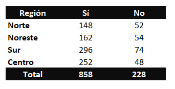
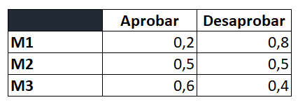

## Homework

Utilizando Python cálcular las siguientes probabilidades. Para cada uno intenta determinar que método aplicaste. 

1. Lanza una moneda al aire 10 veces, ¿cuantos resultados posibles forman parte del espacio muestral?.
2. En un aeropuerto se tiene a 10 pasajeros esperando en la sala de preembarque, la polícia debe controlar a 3 de ellos. ¿Cuantas combinaciones posibles se pueden obtener?.
3. La Agencia Nacional de Seguridad Vial realizó una investigación para saber si los conductores de están usando sus cinturones de seguridad. Los datos muestrales fueron los siguientes: 
Conductores que emplean el cinturón  

- a) ¿Qué metodo cree que se utilizo para asignar probabilidades?.
- b) Construya un cuadro similar, pero con la asignación de probabilidades.
- c) ¿Cuál sería el mejor método pára estimar la probabilidad de que en Estados Unidos un conductor lleve puesto el cinturón?.
- d) Un año antes, la probabilidad en Argentina de que un conductor llevara puesto el cinturón era 0.75. El director de ANSV, se esperaba que la probabilidad llegara a 0.78. ¿Estará satisfecho con los resultados del estudio? (Utilizar tabla adjunta ()
- e) ¿Cuál es la probabilidad de que se use el cinturón en las distintas regiones del país? ¿En qué región se usa más el cinturón?(Utilizar misma tabla que el ejercicio anterior).

4. Crear una funcion que permita calcular a probabilidad de los siguientes eventos en un baraja de 52 cartas. 
- Obtener una carta roja. 
- Obtener una carta negra. 
- Obtener una pica. 
- Obtener un trébol. 
- Obtener un corazón. 
- Obtener un diamante. 
5. La probabilidad de que salga un 7 o un 8 al seleccionar una carta de una baraja de las 52 cartas que contiene el mazo.  
6. La probabilidad de tu país gane el mundial de fútbol. 
7. Un experimento que tiene tres resultados es repetido 50 veces y se ve que E1 aparece 20 veces, E2 13 veces y E3 17 veces. Asigne probabilidades a los resultados. 

## Desafíos complementarios 

### Investiga e intenta resolver los siguientes ejercicios

1. Si la probabilidad de que un cliente pague en efectivo (E) es 6/15, con tarjeta de crédito (TD) es 7/15 y con tarjeta de débito (TD) es 2/15. Hallar la probabilidad de que dos clientes sucesivos que pagan sus cuentas lo hagan: 
 a) el primero en efectivo y el segundo con tarjeta de crédito. 
 b) Los dos clientes en efectivo 
2. La probabilidad de que un Henry repruebe el M1 de 0.8, de que apruebe M2 es 0.5 y de que repruebe el M3 es de 0.4. 
 (Los eventos no interfieren entre si)  

Determinar la probabilidad de que: 
 a) Apruebe un módulo. 
 b) Repruebe las tres materias.

