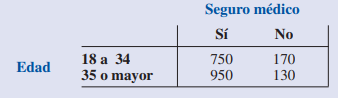

## Homework

1. Suponga dos eventos, A y B, y que P(A) = 0.50, P(B) = 0.60 y P(A ∩ B) = 0.40. 
- a. Halle P(A | B).
- b. Halle P(B | A).
- c. ¿A y B son independientes? ¿Por qué sí o por qué no?

2. Suponga dos eventos, A y B, que son mutuamente excluyentes. Admita, además, que P(A) = 0.30 y P(B) = 0.40. 
- a. Obtenga P(A ∩ B). ¿Existe intersección entre los dos conjuntos?.
- b. Calcule P(A | B).
- c. Un estudiante de estadística argumenta que los conceptos de eventos mutuamente excluyentes y eventos independientes son en realidad lo mismo y que si los eventos son mutuamente excluyentes deben ser también independientes. ¿Está usted de acuerdo? Use la información sobre las probabilidades para justificar su respuesta.

Dada la siguiente tabla: 
 

3. Si en la concesionaria se seleccionan dos ventas con reposición (Los sucesos son independientes.). Hallar la probabilidad de que las ventas sean: 
 
  - a. La primera de un comprador de “menos de 40 años” y la segunda de uno de "entre 40 y 50 años". 
  
  - b. las dos sean de autos "nacionales".

4. Si la selección de las dos ventas se realiza sin reposición. Hallar la probabilidad de que las ventas sean: 
  Los sucesos son condicionales.

 - a. la primera de un comprador de “menos de 40 años” y la segunda de uno de "entre 40 y 50 años".

 - b. las dos sean de autos "nacionales".

5. Si la selección de las dos ventas se realiza sin reposición. Hallar la probabilidad de que las ventas sean: 
  Los sucesos son condicionales.
  
 - a. De un comprador de “menos de 40 años” y de uno de "entre 40 y 50 años". Sin importar el orden.

 6. Debido al aumento de los costos de los seguros, en un país 43 millones de personas, hay personas que no cuentan con un seguro médico. En la tabla siguiente se muestran datos muestrales representativos de la cantidad de personas que cuentan con seguro médico: 
 

- a. Con estos datos elabore una tabla de probabilidad conjunta y úsela para responder las preguntas restantes.
- b. ¿Qué indican las probabilidades marginales acerca de la edad de la población?
- c. ¿Cuál es la probabilidad de que una persona tomada en forma aleatoria no tenga seguro médico?
- d. Si la persona tiene entre 18 y 34 años, ¿cuál es la probabilidad de que no tenga seguro médico?
- e. Si la persona tiene 35 años o más ¿cuál es la probabilidad de que no tenga seguro médico?
- f. Si la persona no tiene seguro médico, ¿cuál es la probabilidad de que tenga entre 18 y 34 años?

#### Puedes complementar con los ejercicios del 33 al 40 del Capitula 4 del libro "ESTADÍSTICA PARA ADMINISTRACIÓN Y ECONOMÍA"
